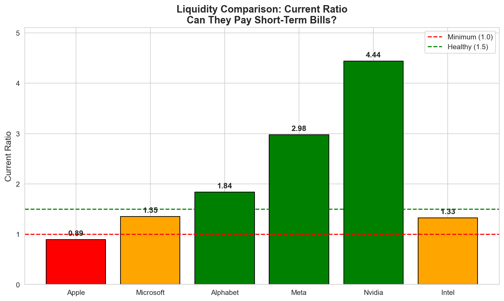
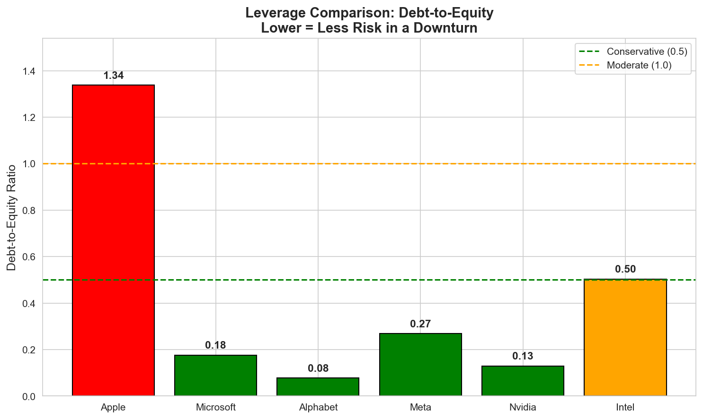
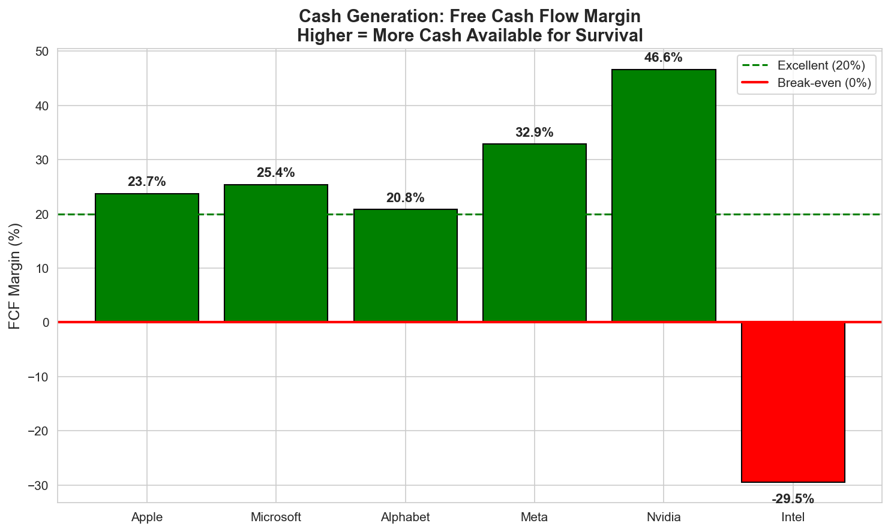
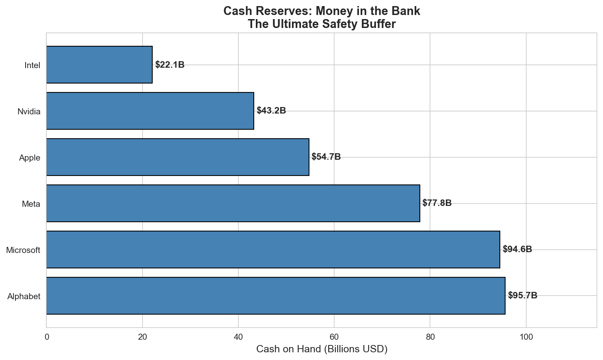

# Which Tech Giant Is Best Positioned for a Downturn?

A financial health analysis comparing six major technology companies to determine which would best survive an economic recession.

## The Question

When the economy slows down, not all companies are equally prepared. This analysis examines liquidity, leverage, and cash flow metrics to answer: **If a recession hit tomorrow, who would be in the strongest position to survive?**

## Companies Analyzed

| Company | Ticker | Business Focus |
|---------|--------|----------------|
| Apple | AAPL | Consumer hardware + services |
| Microsoft | MSFT | Enterprise software + cloud |
| Alphabet | GOOGL | Digital advertising + cloud |
| Meta | META | Social media + advertising |
| Nvidia | NVDA | Semiconductors (AI/GPU) |
| Intel | INTC | Semiconductors (CPU) |

## Key Findings

### Overall Ranking (Best to Worst Positioned)

1. **Nvidia** — Exceptional liquidity (4.44) and cash generation (46.6% FCF margin)
2. **Alphabet** — Lowest debt exposure (0.08 D/E), largest cash reserves ($95.7B)
3. **Meta** — Strong liquidity (2.98) and substantial cash ($77.8B)
4. **Microsoft** — Balanced profile across all metrics, $94.6B cash
5. **Apple** — Weak liquidity on paper, but intentional due to predictable cash flow
6. **Intel** — Burning cash (-29.5% FCF margin) during turnaround

### Notable Observations

- **Nvidia** leads in both liquidity and cash flow efficiency, driven by AI demand
- **Alphabet** has the largest cash reserves (~$96B) and operates with almost zero debt
- **Microsoft** sits close behind with ~$95B in cash reserves
- **Intel** is in a precarious position with negative free cash flow and lowest cash reserves (~$22B)
- **Apple's** low current ratio (0.89) looks concerning but is a deliberate strategy given their reliable cash generation

## Metrics Used

### Liquidity (Can they pay short-term bills?)
- **Current Ratio** = Current Assets / Current Liabilities
- **Quick Ratio** = (Current Assets - Inventory) / Current Liabilities

### Leverage (How much debt risk?)
- **Debt-to-Equity** = Total Debt / Stockholders Equity
- **Interest Coverage** = Operating Income / Interest Expense

### Cash Flow (Do they generate real cash?)
- **Free Cash Flow** = Operating Cash Flow - Capital Expenditure
- **FCF Margin** = Free Cash Flow / Total Revenue

## Visualizations

### Liquidity: Can They Pay Short-Term Bills?


### Leverage: How Much Debt Risk?


### Cash Generation: Free Cash Flow Margin


### Cash Reserves: The Ultimate Safety Buffer


## Project Structure

```
tech-financial-health-analyzer/
│
├── README.md
├── requirements.txt
│
└── notebooks/
    └── analysis.ipynb      # Main analysis notebook
```

## How to Run

1. Clone the repository:
```bash
git clone https://github.com/yourusername/tech-financial-health-analyzer.git
cd tech-financial-health-analyzer
```

2. Install dependencies:
```bash
pip install -r requirements.txt
```

3. Open the notebook:
```bash
jupyter notebook notebooks/analysis.ipynb
```

4. Run all cells to reproduce the analysis

## Data Source

All financial data is retrieved from Yahoo Finance using the `yfinance` Python library. Data reflects the most recent annual financial statements available at the time of analysis.

## Limitations

- **Point-in-time snapshot**: Financial health changes; this uses the most recent annual data
- **Ratios don't tell the whole story**: Apple's low current ratio is intentional, not problematic
- **Industry differences**: Comparing hardware vs. software companies has inherent limitations
- **Data source**: Yahoo Finance data may have inconsistencies; verify against SEC filings for professional use

## Tools Used

- **Python 3.8+**
- **pandas** — Data manipulation
- **yfinance** — Financial data retrieval
- **matplotlib** — Visualizations
- **seaborn** — Chart styling

## Author

Jaden Strong

## License

MIT License - feel free to use this analysis as a template for your own research.
